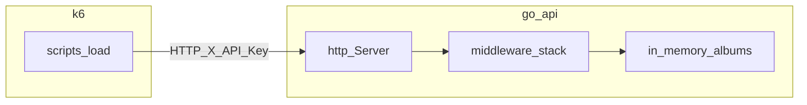

# Performance / load test report — go-api

**Date:** 2026-04-05  
**Author:** automated k6 run + manual template (fill owner name when publishing)  
**k6:** v0.57.0 (see `scripts/load/run-all.sh` / `.tools/k6` optional binary)

## Executive summary

The go-api HTTP service was exercised on **localhost** with **k6** using the scripts in [`scripts/load/`](../scripts/load/). Under the scenarios below, **all k6 checks passed** (HTTP 200 on exercised endpoints). Throughput reached approximately **18k–25k HTTP requests per second** on the sustained and spike-style runs, with **p95 request latency** growing from sub‑millisecond (single VU baseline) to roughly **3.6 ms (35 VUs, 45 s)** and **12 ms (150 VU spike)**—still on loopback, with **load generator and server sharing one WSL2 host**, which limits how much we can infer about production capacity.

**Recommendation:** Treat these numbers as a **regression baseline** only. Re-run after meaningful changes (middleware, JSON payloads, persistence). For production planning, repeat on hardware similar to prod and capture **CPU, RSS, and optional pprof** alongside k6 (see [`load-test-observability.md`](load-test-observability.md)).

## Scope and non-goals

**In scope**

- `GET /healthz` (no API key)
- `GET /albums` and `GET /albums/{id}` with `X-API-Key` (same scripts as album load)
- Scenarios: baseline, health-only, albums GET, staged ramp to 100 VUs, sustained 35 VUs × 45 s, spike to 150 VUs (stages in `scenario-spike.js`)

**Out of scope**

- TLS / HTTP/2
- Multiple server processes or external load balancer
- `POST /albums` write-heavy mix (script exists: `scenario-write-mix.js`; not part of this matrix)
- Formal CPU/RSS sampling in this document (procedure documented in [`load-test-observability.md`](load-test-observability.md))

## System under test

| Attribute | Value |
|-----------|--------|
| OS | Linux 6.6.87.2-microsoft-standard-WSL2 (x86_64) |
| Go | go1.22.1 linux/amd64 |
| Listen address | `127.0.0.1:18081` (default for `run-all.sh`) |
| API key | From repo `.env` (redacted); must match k6 (`run-all.sh` sources `.env` and passes `-e API_KEY=...`) |
| Server build | `go run ./cmd/server` (no special build tags) |
| Optional pprof | `PPROF_ADDR` supported in [`cmd/server/main.go`](../cmd/server/main.go); not enabled for this run |

## Methodology

1. **Tooling:** k6, scripts under [`scripts/load/`](../scripts/load/).
2. **Orchestration:** [`scripts/load/run-all.sh`](../scripts/load/run-all.sh) — frees the chosen TCP port, starts the API, waits for `/healthz`, runs scenarios sequentially, writes JSON summaries to [`docs/load-results/`](../docs/load-results/).
3. **Metrics (k6 summary JSON):**
   - **http_reqs rate:** requests per second (aggregate over the scenario).
   - **http_req_duration p(95):** 95th percentile of **successful** request duration where submetric `expected_response:true` exists; otherwise overall `http_req_duration` (values in **milliseconds** in Grafana k6 JSON export).
   - **checks:** k6 check pass ratio (we assert status 200 where applicable).

Raw exports: `summary-*.json` in [`docs/load-results/`](../docs/load-results/).

## Results (representative run)

Approximate numbers from the JSON summaries produced by `run-all.sh` on 2026-04-05.

| Scenario (script) | Virtual users | Scenario wall time | http_reqs/s | p95 `http_req_duration` (ms) | Checks |
|-------------------|---------------|--------------------|------------:|-------------------------------:|--------|
| Baseline (`scenario-baseline.js`) | 1 | 30 s | ~1 770 | ~0.70 | 100% |
| Health (`health.js`) | 5 | 30 s | ~1 632 | ~8.07 | 100% |
| Albums GET (`albums-get.js`) | 10 | 30 s | ~4 766 | ~6.19 | 100% |
| Ramp (`scenario-ramp.js`) | 1 → 100 (stages) | ~2.5 min | ~17 881 | ~6.27 | 100% |
| Sustained (`scenario-sustained.js`) | 35 | 45 s | ~25 504 | ~3.55 | 100% |
| Spike (`scenario-spike.js`) | 1 → 150 (stages) | ~2.5 min | ~18 111 | ~11.96 | 100% |

**Note:** Baseline’s `http_reqs/s` counts **two HTTP calls per iteration** (health + albums), so it is not directly comparable to single-endpoint scripts.

### Latency interpretation

- Sub-millisecond medians at low concurrency are typical for **in-memory** work on loopback.
- **p95 in the multi‑millisecond range** under tens–hundreds of VUs on one laptop often reflects **scheduler contention, logging (`slog` per request), JSON serialization, and mutex use** on the album store—not necessarily network.
- Occasional **multi-second max** latencies in summaries usually indicate **tail events** (GC, OS scheduling); inspect time-series if this becomes a product concern.

## Analysis

- **Correctness under load:** No failed checks in the exported summaries for this run; the service continued returning expected status codes for the tested routes.
- **Auth path:** Album routes require `X-API-Key`. The runner must use the **same** key as the server after `.env` loading; misalignment produces **401** and invalidates a run (this was handled in `run-all.sh` by sourcing `.env` and `k6 run -e`).
- **Bottleneck hypotheses (not proven without pprof/CPU data):** per-request logging, JSON encode for album list, `RWMutex` on reads (usually cheap), and **single-core saturation** when k6 and the server compete on one machine.

## Risks and limits

- **localhost only** — no WAN RTT, no TLS handshake cost.
- **Single process** — no horizontal scaling story.
- **In-memory data** — tiny payload; results will change with a real database or larger responses.
- **WSL2** — I/O and scheduling differ from Linux-on-bare-metal or cloud VMs.

## Recommendations

1. Check in **`run-all.sh` results** (or CI artifacts) after each release candidate to spot **regressions in RPS or p95**.
2. For deeper analysis, enable **`PPROF_ADDR=127.0.0.1:6060`** during a sustained test and capture a 30 s CPU profile ([`load-test-observability.md`](load-test-observability.md)).
3. Add **`scenario-write-mix.js`** to the matrix when tuning **write lock** behavior.
4. When moving toward production: run the same scripts against a **staging** host with **similar CPU/RAM** and capture **RSS over 15 minutes** to rule out leaks.

## Appendix: reproduction

```bash
cd /path/to/go-api
# Ensure .env exists with API_KEY (and optional ADDR — run-all uses 18081 by default)
./scripts/load/run-all.sh
```

Optional: `PORT=18082 API_KEY=secret ./scripts/load/run-all.sh`

Artifacts: [`docs/load-results/summary-*.json`](../docs/load-results/).

## Appendix: architecture (test flow)


