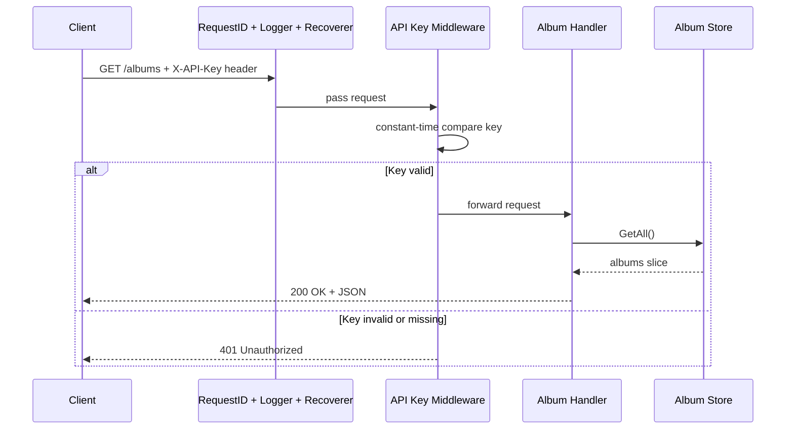
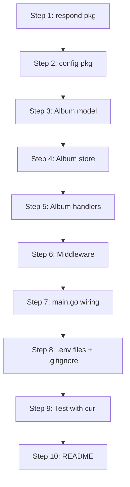

# Go Standard Library REST API -- Album Store

## What We Are Building

The same album-store API from the Gin tutorial (GET all albums, POST a new album, GET album by ID), but built with **zero external dependencies** using production-grade patterns found in big-tech Go services.

## Project Structure

```
web-service/
├── cmd/
│   └── server/
│       └── main.go              # Entry point: config, wiring, graceful shutdown
├── internal/
│   ├── albums/
│   │   ├── handler.go           # HTTP handlers (getAll, getByID, create)
│   │   ├── model.go             # Album struct + validation
│   │   └── store.go             # In-memory store (repository pattern)
│   ├── config/
│   │   └── config.go            # .env parser + Config struct
│   ├── middleware/
│   │   └── middleware.go        # Logging, panic recovery, request-ID, API key auth
│   └── respond/
│       └── json.go              # JSON encode/decode + error helpers
├── .env                          # Local secrets (git-ignored)
├── .env.example                  # Template showing required vars (committed)
├── .gitignore
├── go.mod
└── README.md
```

**Why this layout?**

- `cmd/` -- each sub-directory is a separate binary; standard in large Go repos.
- `internal/` -- compiler-enforced encapsulation; nothing outside the module can import these packages.
- Domain packages (`albums/`) own their handler, model, and data-access code together -- the "vertical slice" approach used at companies like Uber and Google.
- `.env` stays local and git-ignored; `.env.example` is committed so collaborators know what to set.

## Key Production-Grade Concepts Covered

### 1. Enhanced `net/http` Routing (Go 1.22+)

Go 1.22 added method + path-parameter support to `http.ServeMux`, eliminating the need for Gin or chi:

```go
mux := http.NewServeMux()
mux.HandleFunc("GET /albums", handler.GetAll)
mux.HandleFunc("GET /albums/{id}", handler.GetByID)
mux.HandleFunc("POST /albums", handler.Create)
```

`{id}` is extracted via `r.PathValue("id")` -- direct replacement for Gin's `c.Param("id")`.

### 2. Repository Pattern (`internal/albums/store.go`)

Decouple data access from HTTP logic. The in-memory store will use a `sync.RWMutex` for safe concurrent access (Gin's tutorial silently ignores this race condition):

```go
type Store struct {
    mu     sync.RWMutex
    albums []Album
    nextID int
}
```

This teaches the pattern so that swapping to PostgreSQL later is a one-file change.

### 3. API Key Authentication via `.env`

A simple, effective approach: a single secret key stored in a `.env` file, checked on every request via the `X-API-Key` header.

`**.env` file (git-ignored):

```
API_KEY=my-super-secret-random-key-here
```

`**.env.example` (committed to repo):

```
API_KEY=change-me-to-a-random-string
```

**Hand-rolled `.env` parser (`internal/config/config.go`):**

A ~20-line parser that reads `.env`, splits on `=`, trims whitespace, skips comments and blank lines. This is a nice learning exercise -- you'll see exactly how tools like `godotenv` work under the hood:

```go
func LoadEnv(path string) error {
    // open file, scan line by line
    // skip empty lines and lines starting with #
    // split on first '=' -> key, value
    // call os.Setenv(key, value)
}

type Config struct {
    Addr   string // env: ADDR, defaults to ":8080"
    APIKey string // env: API_KEY, required
}
```

**API Key middleware (in `internal/middleware/middleware.go`):**

Uses `crypto/subtle.ConstantTimeCompare` for timing-attack-safe comparison -- a small detail that separates amateur from production code:

```go
func RequireAPIKey(apiKey string) func(http.Handler) http.Handler {
    return func(next http.Handler) http.Handler {
        return http.HandlerFunc(func(w http.ResponseWriter, r *http.Request) {
            provided := r.Header.Get("X-API-Key")
            if subtle.ConstantTimeCompare([]byte(provided), []byte(apiKey)) != 1 {
                respond.Error(w, http.StatusUnauthorized, "invalid or missing API key")
                return
            }
            next.ServeHTTP(w, r)
        })
    }
}
```

**Route protection:**

All endpoints require the API key except `GET /healthz`.

Wired in `main.go` by applying the `RequireAPIKey` middleware to the album routes only, while `/healthz` is registered on a separate, unprotected mux (or checked by path in the middleware).

### 4. Middleware Chain (`internal/middleware/`)

Composable `func(http.Handler) http.Handler` middleware -- the same signature used across the Go ecosystem:

- **RequestID** -- injects a unique ID into every request via `X-Request-ID` header and context.
- **Logger** -- structured request/response logging with `log/slog` (method, path, status, duration).
- **Recoverer** -- catches panics in handlers, logs the stack trace, returns 500.

Middleware is stacked in `main.go`:

```go
handler := middleware.RequestID(
    middleware.Logger(
        middleware.Recoverer(mux)))
```

### 5. Graceful Shutdown (`cmd/server/main.go`)

Catch `SIGINT`/`SIGTERM`, drain in-flight requests, then exit cleanly:

```go
ctx, stop := signal.NotifyContext(context.Background(), os.Interrupt, syscall.SIGTERM)
defer stop()

go func() { srv.ListenAndServe() }()
<-ctx.Done()
srv.Shutdown(shutdownCtx)
```

### 6. HTTP Server Timeouts

Bare `http.ListenAndServe` has no timeouts -- a production anti-pattern. We configure:

```go
srv := &http.Server{
    Addr:         cfg.Addr,
    Handler:      handler,
    ReadTimeout:  5 * time.Second,
    WriteTimeout: 10 * time.Second,
    IdleTimeout:  120 * time.Second,
}
```

### 7. Configuration from Environment

The `.env` parser feeds into a `Config` struct. The server refuses to start if `API_KEY` is missing -- fail fast, fail loud:

```go
type Config struct {
    Addr   string // env: ADDR, defaults to ":8080"
    APIKey string // env: API_KEY, required -- server won't start without it
}
```

### 8. Structured Logging with `log/slog`

Replace `fmt.Println` / `log.Printf` with the stdlib structured logger:

```go
slog.Info("server started", "addr", cfg.Addr)
slog.Error("failed to decode request", "error", err, "request_id", reqID)
```

### 9. Consistent JSON Response Helpers (`internal/respond/`)

Centralize JSON encoding and error formatting so every handler returns consistent shapes:

```go
respond.JSON(w, http.StatusOK, albums)
respond.Error(w, http.StatusNotFound, "album not found")
```

Error responses always follow a uniform structure: `{"error": "message"}`.

### 10. Input Validation (`internal/albums/model.go`)

A `Validate()` method on the `Album` struct to reject bad input before it hits the store -- something the Gin tutorial skips:

```go
func (a Album) Validate() error {
    if a.Title == "" { return errors.New("title is required") }
    if a.Artist == "" { return errors.New("artist is required") }
    if a.Price < 0 { return errors.New("price must be non-negative") }
    return nil
}
```

### 11. Health Check Endpoint

A `GET /healthz` endpoint for liveness probes -- standard in any production service:

```go
mux.HandleFunc("GET /healthz", func(w http.ResponseWriter, r *http.Request) {
    respond.JSON(w, http.StatusOK, map[string]string{"status": "ok"})
})
```

## API Endpoints Summary

**Public (no auth):**

- `GET /healthz` -- liveness probe

**Protected (requires `X-API-Key` header):**

- `GET /albums` -- list all albums
- `POST /albums` -- create a new album
- `GET /albums/{id}` -- get album by ID

## Request Flow Diagram



## Implementation Order -- Step by Step

The golden rule: **build from the leaves inward**. Start with packages that have zero internal dependencies, then layer on the packages that import them. This way every file compiles and is testable the moment you write it -- no stubs, no forward references.



### Step 1 -- `internal/respond/json.go` (no internal imports)

Start here because **every other package** will use these helpers. This file has zero dependencies on your own code -- it only imports `encoding/json` and `net/http`. Write `JSON()`, `Error()`, and `Decode()`. Once done, you have a reusable foundation for all handlers.

**Why first:** Nothing depends on it, but everything will import it.

### Step 2 -- `internal/config/config.go` (no internal imports)

The `.env` parser and `Config` struct. This only uses `os`, `bufio`, and `strings` from stdlib. It gives you the ability to load `API_KEY` and `ADDR` from a file. Build it now so `main.go` can use it later without backtracking.

**Why second:** Also has no internal dependencies, and `main.go` will need it to pass the API key to middleware.

### Step 3 -- `internal/albums/model.go` (no internal imports)

Define the `Album` struct with JSON tags and the `Validate()` method. This is pure data -- no HTTP, no storage logic. Just a struct and a function that returns an `error`.

**Why third:** The store and handlers both depend on this type, so it must exist first.

### Step 4 -- `internal/albums/store.go` (imports: `albums/model`)

The in-memory store with `sync.RWMutex`. Methods: `GetAll()`, `GetByID(id)`, `Create(album)`. Seed it with the three jazz albums from the tutorial. This is your "repository layer."

**Why fourth:** Handlers call into the store, so the store must exist before handlers.

### Step 5 -- `internal/albums/handler.go` (imports: `albums/model`, `albums/store`, `respond`)

Now you write the three HTTP handlers: `GetAll`, `GetByID`, `Create`. Each one is a method on a `Handler` struct that holds a `*Store`. This is where `respond.JSON()`, `respond.Error()`, and `respond.Decode()` pay off -- your handler code stays clean.

**Why fifth:** This is the first file that touches `net/http` handler logic. All its dependencies (model, store, respond) already exist.

### Step 6 -- `internal/middleware/middleware.go` (imports: `respond`)

Write the four middleware functions: `RequestID`, `Logger`, `Recoverer`, and `RequireAPIKey`. Each follows the `func(http.Handler) http.Handler` pattern. The API key middleware uses `crypto/subtle.ConstantTimeCompare`.

**Why sixth:** Middleware wraps handlers, so handlers should exist first (conceptually). It also imports `respond` for error responses, which already exists from step 1.

### Step 7 -- `cmd/server/main.go` (imports everything)

This is the wiring file. It:

1. Calls `config.Load()` to read `.env` and build a `Config`
2. Creates an `albums.Store` with seed data
3. Creates an `albums.Handler` with the store
4. Builds an `http.ServeMux` and registers routes
5. Stacks middleware: `RequestID -> Logger -> Recoverer -> RequireAPIKey -> mux`
6. Configures `http.Server` with timeouts
7. Starts the server with graceful shutdown

**Why seventh:** This is the "root" of the dependency tree -- it imports everything else. Writing it last means all the pieces are already built and tested.

### Step 8 -- `.env`, `.env.example`, `.gitignore`

Create the three dotfiles:

- `.env` with your actual `API_KEY` value (you pick a random string)
- `.env.example` with `API_KEY=change-me-to-a-random-string` as a template
- `.gitignore` with `.env` so your secret never gets committed

**Why eighth:** You need these before you can actually run the server, but they are not Go code so they come after all Go files are written.

### Step 9 -- Test with `curl`

Run `go run ./cmd/server` and hit the endpoints:

1. `GET /healthz` -- should work without an API key (200)
2. `GET /albums` without key -- should get 401
3. `GET /albums` with `X-API-Key` header -- should get the 3 seed albums
4. `POST /albums` with key + JSON body -- should get 201 + the new album
5. `GET /albums/{id}` with key -- should get a single album
6. `GET /albums/999` with key -- should get 404

**Why ninth:** Validates everything works end to end before you write docs.

### Step 10 -- `README.md`

Document what the project is, how to set up `.env`, how to run it, and include the curl examples from step 9 so future-you (or anyone else) can get started in 30 seconds.

**Why last:** You can only write accurate docs after the code is done and tested.

---

## File-by-File Reference -- What Goes Where

Below is every file, what it needs to do, and the expected code. This is your "answer key" -- work through them in order (Step 1 through 10) and you'll have a running API at the end.

For reference, here's the Gin tutorial equivalent mapped to our stdlib version:

- `gin.Context` -> `http.ResponseWriter` + `*http.Request`
- `c.IndentedJSON(status, data)` -> `respond.JSON(w, status, data)`
- `c.BindJSON(&obj)` -> `respond.Decode(r, &obj)`
- `c.Param("id")` -> `r.PathValue("id")`
- `router.GET("/path", handler)` -> `mux.HandleFunc("GET /path", handler)`
- `gin.H{"key": "val"}` -> `map[string]string{"key": "val"}`

---

### File 1: `internal/respond/json.go`

**Todo:** Write three helper functions that every handler will use.

- `JSON(w, statusCode, data)` -- encode any value as JSON, set Content-Type, write status code
- `Error(w, statusCode, message)` -- write a uniform `{"error": "..."}` response
- `Decode(r, dest)` -- read the request body, decode JSON into dest, return error if bad

```go
package respond

import (
	"encoding/json"
	"net/http"
)

func JSON(w http.ResponseWriter, status int, data any) {
	w.Header().Set("Content-Type", "application/json")
	w.WriteHeader(status)
	if data != nil {
		json.NewEncoder(w).Encode(data)
	}
}

type errorBody struct {
	Error string `json:"error"`
}

func Error(w http.ResponseWriter, status int, msg string) {
	JSON(w, status, errorBody{Error: msg})
}

func Decode(r *http.Request, dest any) error {
	defer r.Body.Close()
	return json.NewDecoder(r.Body).Decode(dest)
}
```

---

### File 2: `internal/config/config.go`

**Todo:** Write a `.env` file parser and a `Config` struct loader.

- `LoadEnv(path)` -- open the file, read line by line, skip blanks/comments, split on `=`, call `os.Setenv`
- `Load()` -- call `LoadEnv`, then read env vars into a `Config` struct; fail if `API_KEY` is missing

```go
package config

import (
	"bufio"
	"fmt"
	"os"
	"strings"
)

type Config struct {
	Addr   string
	APIKey string
}

func LoadEnv(path string) error {
	f, err := os.Open(path)
	if err != nil {
		return err
	}
	defer f.Close()

	scanner := bufio.NewScanner(f)
	for scanner.Scan() {
		line := strings.TrimSpace(scanner.Text())
		if line == "" || strings.HasPrefix(line, "#") {
			continue
		}
		key, value, ok := strings.Cut(line, "=")
		if !ok {
			continue
		}
		os.Setenv(strings.TrimSpace(key), strings.TrimSpace(value))
	}
	return scanner.Err()
}

func Load() (*Config, error) {
	_ = LoadEnv(".env") // ignore error -- .env is optional, env vars may be set directly

	apiKey := os.Getenv("API_KEY")
	if apiKey == "" {
		return nil, fmt.Errorf("API_KEY environment variable is required")
	}

	addr := os.Getenv("ADDR")
	if addr == "" {
		addr = ":8080"
	}

	return &Config{Addr: addr, APIKey: apiKey}, nil
}
```

---

### File 3: `internal/albums/model.go`

**Todo:** Define the `Album` struct and a `Validate()` method.

- Struct with JSON tags (same fields as Gin tutorial: ID, Title, Artist, Price)
- `Validate()` returns an error if required fields are missing or price is negative

This replaces the Gin tutorial's bare `type album struct` -- same data, but with validation.

```go
package albums

import "errors"

type Album struct {
	ID     string  `json:"id"`
	Title  string  `json:"title"`
	Artist string  `json:"artist"`
	Price  float64 `json:"price"`
}

func (a Album) Validate() error {
	if a.Title == "" {
		return errors.New("title is required")
	}
	if a.Artist == "" {
		return errors.New("artist is required")
	}
	if a.Price < 0 {
		return errors.New("price must be non-negative")
	}
	return nil
}
```

---

### File 4: `internal/albums/store.go`

**Todo:** Build a thread-safe in-memory store with seed data.

- `NewStore()` -- returns a store pre-loaded with the 3 jazz albums from the Gin tutorial
- `GetAll()` -- returns a copy of all albums (read lock)
- `GetByID(id)` -- loops to find a match, returns `(Album, bool)` (read lock)
- `Create(album)` -- appends to the slice (write lock)

This replaces the Gin tutorial's `var albums = []album{...}` global variable -- same data, but safe for concurrent access.

```go
package albums

import "sync"

type Store struct {
	mu     sync.RWMutex
	albums []Album
}

func NewStore() *Store {
	return &Store{
		albums: []Album{
			{ID: "1", Title: "Blue Train", Artist: "John Coltrane", Price: 56.99},
			{ID: "2", Title: "Jeru", Artist: "Gerry Mulligan", Price: 17.99},
			{ID: "3", Title: "Sarah Vaughan and Clifford Brown", Artist: "Sarah Vaughan", Price: 39.99},
		},
	}
}

func (s *Store) GetAll() []Album {
	s.mu.RLock()
	defer s.mu.RUnlock()
	result := make([]Album, len(s.albums))
	copy(result, s.albums)
	return result
}

func (s *Store) GetByID(id string) (Album, bool) {
	s.mu.RLock()
	defer s.mu.RUnlock()
	for _, a := range s.albums {
		if a.ID == id {
			return a, true
		}
	}
	return Album{}, false
}

func (s *Store) Create(a Album) {
	s.mu.Lock()
	defer s.mu.Unlock()
	s.albums = append(s.albums, a)
}
```

---

### File 5: `internal/albums/handler.go`

**Todo:** Write the three HTTP handlers that map 1:1 to the Gin tutorial.

- `GetAll` -- replaces `getAlbums(c *gin.Context)` -- calls `store.GetAll()`, responds with JSON
- `GetByID` -- replaces `getAlbumByID(c *gin.Context)` -- uses `r.PathValue("id")` instead of `c.Param("id")`
- `Create` -- replaces `postAlbums(c *gin.Context)` -- uses `respond.Decode` instead of `c.BindJSON`

Handler methods live on a `Handler` struct that holds a `*Store` (dependency injection).

```go
package albums

import (
	"net/http"

	"web-service/internal/respond"
)

type Handler struct {
	store *Store
}

func NewHandler(s *Store) *Handler {
	return &Handler{store: s}
}

func (h *Handler) GetAll(w http.ResponseWriter, r *http.Request) {
	respond.JSON(w, http.StatusOK, h.store.GetAll())
}

func (h *Handler) GetByID(w http.ResponseWriter, r *http.Request) {
	id := r.PathValue("id")

	album, found := h.store.GetByID(id)
	if !found {
		respond.Error(w, http.StatusNotFound, "album not found")
		return
	}
	respond.JSON(w, http.StatusOK, album)
}

func (h *Handler) Create(w http.ResponseWriter, r *http.Request) {
	var a Album
	if err := respond.Decode(r, &a); err != nil {
		respond.Error(w, http.StatusBadRequest, "invalid JSON")
		return
	}
	if err := a.Validate(); err != nil {
		respond.Error(w, http.StatusBadRequest, err.Error())
		return
	}

	h.store.Create(a)
	respond.JSON(w, http.StatusCreated, a)
}
```

---

### File 6: `internal/middleware/middleware.go`

**Todo:** Write four composable middleware functions.

- `RequestID` -- generates a UUID-like ID, sets `X-Request-ID` header, stores in context
- `Logger` -- logs method, path, status, and duration using `log/slog`
- `Recoverer` -- wraps handler in `defer/recover`, logs panic, returns 500
- `RequireAPIKey` -- checks `X-API-Key` header with constant-time compare

Each one takes an `http.Handler` and returns an `http.Handler`.

```go
package middleware

import (
	"crypto/rand"
	"crypto/subtle"
	"encoding/hex"
	"log/slog"
	"net/http"
	"time"

	"web-service/internal/respond"
)

type contextKey string

const RequestIDKey contextKey = "request_id"

func RequestID(next http.Handler) http.Handler {
	return http.HandlerFunc(func(w http.ResponseWriter, r *http.Request) {
		id := generateID()
		w.Header().Set("X-Request-ID", id)
		ctx := r.Context()
		ctx = context.WithValue(ctx, RequestIDKey, id)
		next.ServeHTTP(w, r.WithContext(ctx))
	})
}

func generateID() string {
	b := make([]byte, 8)
	rand.Read(b)
	return hex.EncodeToString(b)
}

type statusRecorder struct {
	http.ResponseWriter
	status int
}

func (sr *statusRecorder) WriteHeader(code int) {
	sr.status = code
	sr.ResponseWriter.WriteHeader(code)
}

func Logger(next http.Handler) http.Handler {
	return http.HandlerFunc(func(w http.ResponseWriter, r *http.Request) {
		start := time.Now()
		rec := &statusRecorder{ResponseWriter: w, status: http.StatusOK}

		next.ServeHTTP(rec, r)

		slog.Info("request",
			"method", r.Method,
			"path", r.URL.Path,
			"status", rec.status,
			"duration", time.Since(start).String(),
		)
	})
}

func Recoverer(next http.Handler) http.Handler {
	return http.HandlerFunc(func(w http.ResponseWriter, r *http.Request) {
		defer func() {
			if err := recover(); err != nil {
				slog.Error("panic recovered", "error", err)
				respond.Error(w, http.StatusInternalServerError, "internal server error")
			}
		}()
		next.ServeHTTP(w, r)
	})
}

func RequireAPIKey(apiKey string) func(http.Handler) http.Handler {
	return func(next http.Handler) http.Handler {
		return http.HandlerFunc(func(w http.ResponseWriter, r *http.Request) {
			provided := r.Header.Get("X-API-Key")
			if subtle.ConstantTimeCompare([]byte(provided), []byte(apiKey)) != 1 {
				respond.Error(w, http.StatusUnauthorized, "invalid or missing API key")
				return
			}
			next.ServeHTTP(w, r)
		})
	}
}
```

(Note: needs `import "context"` added -- shown minimal for clarity.)

---

### File 7: `cmd/server/main.go`

**Todo:** Wire everything together.

This replaces the Gin tutorial's `func main()` that used `gin.Default()`, `router.GET()`, `router.POST()`, and `router.Run()`.

- Load config from `.env`
- Create store and handler
- Register routes on `http.ServeMux`
- Stack middleware (global middleware wraps everything, API key wraps only album routes)
- Configure `http.Server` with timeouts
- Graceful shutdown on SIGINT/SIGTERM

```go
package main

import (
	"context"
	"log/slog"
	"net/http"
	"os"
	"os/signal"
	"syscall"
	"time"

	"web-service/internal/albums"
	"web-service/internal/config"
	"web-service/internal/middleware"
	"web-service/internal/respond"
)

func main() {
	cfg, err := config.Load()
	if err != nil {
		slog.Error("failed to load config", "error", err)
		os.Exit(1)
	}

	store := albums.NewStore()
	handler := albums.NewHandler(store)

	// Protected routes (require API key)
	albumMux := http.NewServeMux()
	albumMux.HandleFunc("GET /albums", handler.GetAll)
	albumMux.HandleFunc("GET /albums/{id}", handler.GetByID)
	albumMux.HandleFunc("POST /albums", handler.Create)

	protected := middleware.RequireAPIKey(cfg.APIKey)(albumMux)

	// Top-level mux: public + protected
	mux := http.NewServeMux()
	mux.HandleFunc("GET /healthz", func(w http.ResponseWriter, r *http.Request) {
		respond.JSON(w, http.StatusOK, map[string]string{"status": "ok"})
	})
	mux.Handle("/", protected)

	// Global middleware stack
	stack := middleware.RequestID(
		middleware.Logger(
			middleware.Recoverer(mux)))

	srv := &http.Server{
		Addr:         cfg.Addr,
		Handler:      stack,
		ReadTimeout:  5 * time.Second,
		WriteTimeout: 10 * time.Second,
		IdleTimeout:  120 * time.Second,
	}

	// Graceful shutdown
	ctx, stop := signal.NotifyContext(context.Background(), os.Interrupt, syscall.SIGTERM)
	defer stop()

	go func() {
		slog.Info("server started", "addr", cfg.Addr)
		if err := srv.ListenAndServe(); err != nil && err != http.ErrServerClosed {
			slog.Error("server error", "error", err)
			os.Exit(1)
		}
	}()

	<-ctx.Done()
	slog.Info("shutting down gracefully")

	shutdownCtx, cancel := context.WithTimeout(context.Background(), 10*time.Second)
	defer cancel()

	if err := srv.Shutdown(shutdownCtx); err != nil {
		slog.Error("shutdown error", "error", err)
	}
}
```

---

### File 8: `.env`, `.env.example`, `.gitignore`

**Todo:** Create three dotfiles.

`**.env` (your local file, git-ignored):

```
API_KEY=super-secret-key-change-this-123
```

`**.env.example**` (committed so others know what to set):

```
# Required -- set this to any random string
API_KEY=change-me-to-a-random-string

# Optional -- defaults to :8080
# ADDR=:8080
```

`**.gitignore**`:

```
.env
```

---

### File 9: Test with `curl`

**Todo:** Run the server and hit every endpoint.

```bash
# Start the server
go run ./cmd/server

# 1. Health check (no key needed)
curl http://localhost:8080/healthz

# 2. List albums WITHOUT key (expect 401)
curl http://localhost:8080/albums

# 3. List albums WITH key (expect 200 + 3 albums)
curl -H "X-API-Key: super-secret-key-change-this-123" http://localhost:8080/albums

# 4. Create a new album (expect 201)
curl -X POST http://localhost:8080/albums \
  -H "X-API-Key: super-secret-key-change-this-123" \
  -H "Content-Type: application/json" \
  -d '{"id":"4","title":"The Modern Sound of Betty Carter","artist":"Betty Carter","price":49.99}'

# 5. Get album by ID (expect 200)
curl -H "X-API-Key: super-secret-key-change-this-123" http://localhost:8080/albums/2

# 6. Get album that doesn't exist (expect 404)
curl -H "X-API-Key: super-secret-key-change-this-123" http://localhost:8080/albums/999
```

---

### File 10: `README.md`

**Todo:** Document setup, run, and usage.

- What the project is
- Prerequisites (Go 1.22+)
- How to create `.env` from `.env.example`
- How to run (`go run ./cmd/server`)
- Curl examples for each endpoint
- Project structure overview

